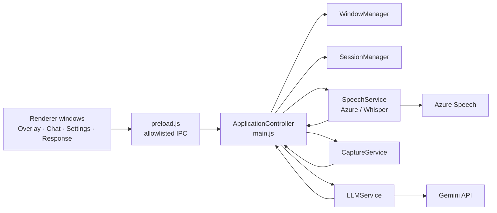
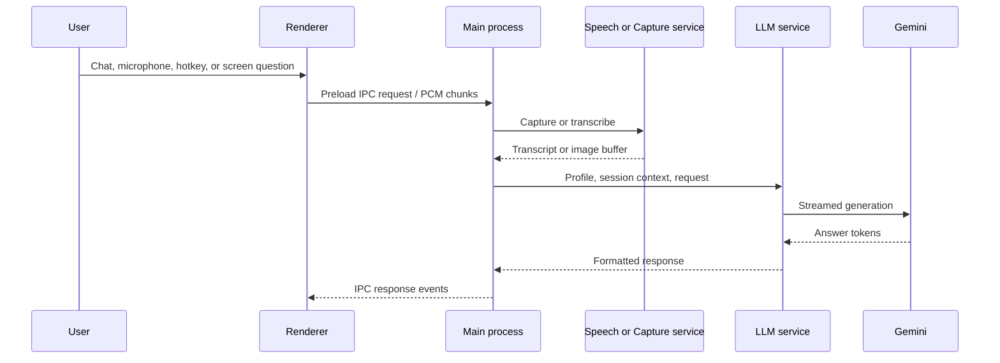
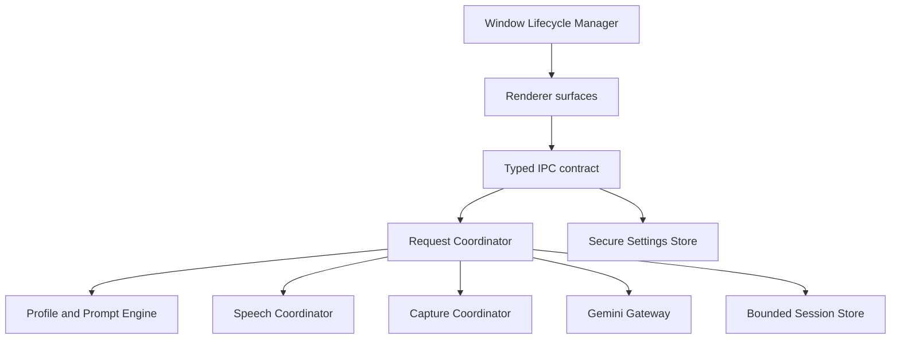

<div align="center">

# OpenCluely

**The invisible AI interview copilot.**

Real-time AI help on a stealth overlay that screen sharing cannot see. Ask by voice or screenshot, and get clear answers that stream in as you need them.

<p>
  <a href="https://github.com/RahulSinghParmar/OpenCluely/releases/latest"></a>
  <a href="https://github.com/RahulSinghParmar/OpenCluely/releases"></a>
  <a href="LICENSE"></a>
  
</p>

<a href="https://github.com/RahulSinghParmar/OpenCluely"><b>Repository</b></a> &nbsp;|&nbsp;
<a href="#download">Download</a> &nbsp;|&nbsp;
<a href="#quick-start">Quick start</a> &nbsp;|&nbsp;
<a href="#how-it-works">How it works</a>

</div>

## Demo

https://github.com/user-attachments/assets/896a7140-1e85-405d-bfbe-e05c9f3a816b

## What it is

OpenCluely is a desktop app for technical interviews and practice. It places a small overlay on your screen that recording and conferencing tools do not capture. You can speak a question or take a screenshot, and the AI answers in real time. The answer streams into a floating window and an optional chat panel, with clean code blocks and syntax highlighting.

It is free and open source. Processing stays on your machine, and the only thing that leaves your device is the request you send to the AI provider.

## Highlights

- **Invisible overlay.** Windows stay out of Zoom, Google Meet, Microsoft Teams, Discord, and OBS captures. You see the answer, the call does not.
- **Hidden during screen share.** When a share starts, the app can hide every window on its own.
- **Flexible local voice.** Choose manual start/stop capture or automatic voice-activity detection without fixed-timer sentence cuts.
- **Configurable streamed answers.** Route voice replies to chat, the floating overlay, or both.
- **Direct image analysis.** Screenshots go straight to Gemini for visual reasoning, with no slow OCR step in between.
- **Session memory.** The whole conversation is remembered, so follow-ups, edge cases, and optimizations keep their context.
- **Language aware.** Tailored answers for C++, C, Python, Java, and JavaScript.
- **Stealthy by design.** Runs under ordinary system names, ships with no telemetry, and keeps your session local.
- **Cross platform.** Pre-built installers for Windows and Linux (.deb and AppImage). macOS runs from source in one command.

## Download

Pre-built installers are published with every release. These links always point at the newest version.

| Platform | File | Notes |
|---|---|---|
| Windows | [Setup .exe](https://github.com/RahulSinghParmar/OpenCluely/releases/latest) | NSIS installer. Adds a Start Menu shortcut. |
| Linux (Debian or Ubuntu) | [.deb](https://github.com/RahulSinghParmar/OpenCluely/releases/latest) | Pulls system deps automatically (Python, ffmpeg, GTK). |
| Linux (universal) | [.AppImage](https://github.com/RahulSinghParmar/OpenCluely/releases/latest) | No install. Run `chmod +x` then launch. |

> **macOS:** there is no pre-built download. The app is unsigned and un-notarized, so macOS Gatekeeper blocks it as "damaged and can't be opened." Run OpenCluely from source instead — see [Quick start](#quick-start). It is a one-line `./setup.sh` once Node.js is installed.

Every build is produced automatically on GitHub Actions and ships with SHA-256 checksums. Each release also lists the full set of commits it includes.

Project updates and releases are published at [RahulSinghParmar/OpenCluely](https://github.com/RahulSinghParmar/OpenCluely).

## Quick start

If you would rather build from source, three steps are all it takes.

1. Clone the repository.

   ```bash
   git clone https://github.com/RahulSinghParmar/OpenCluely.git
   cd OpenCluely
   ```

2. Run the setup script.

   ```bash
   ./setup.sh
   ```

   The script installs Node dependencies, creates your `.env` from the example, sets up a local Whisper virtual environment, points the config at it, and launches the app.

3. Add your Gemini key.

   On first launch the Settings window opens automatically. Get a free key from [Google AI Studio](https://aistudio.google.com/) and paste it in, or edit `.env` directly. Both work, and changes are picked up without a restart.

### Platform notes

- On Windows, use Git Bash (included with Git for Windows) or WSL to run `setup.sh`.
- On macOS and Linux, your normal terminal works.
- **macOS users must build from source** (steps above) — there is no pre-built `.dmg`. Because the app is unsigned, a downloaded build would be blocked by Gatekeeper as "damaged"; running from source avoids that entirely.
- No manual `npm` commands are needed. The script handles everything.

### Setup script options

```bash
./setup.sh --build                # Build a distributable for your OS
./setup.sh --ci                   # Use npm ci instead of npm install
./setup.sh --no-run               # Set up only, do not launch
./setup.sh --install-system-deps  # Install sox for the microphone (optional)
./setup.sh --skip-whisper         # Skip the local Whisper bootstrap
```

## Configuration

The setup script writes sensible defaults. The only required value is a Gemini API key.

```bash
# Required
GEMINI_API_KEY=your_gemini_api_key_here

# Optional speech provider. Pick one.
SPEECH_PROVIDER=whisper

# Azure option
AZURE_SPEECH_KEY=your_azure_speech_key
AZURE_SPEECH_REGION=your_region

# Local Whisper option
WHISPER_COMMAND=whisper
WHISPER_MODEL_DIR=.whisper-models
WHISPER_MODEL=small
WHISPER_LANGUAGE=auto
WHISPER_DEVICE=auto
WHISPER_PYTHON=
WHISPER_CAPTURE_MODE=vad
WHISPER_RESPONSE_TARGET=both
WHISPER_MANUAL_MAX_MS=90000
WHISPER_GPU_IDLE_MS=60000
```

Speech is optional. If no provider is configured, the microphone button hides itself across the app.

## Optional voice setup

You can use local Whisper for offline transcription or Azure Speech for a cloud option.

For local Whisper, `./setup.sh` handles the full setup. It creates `.venv-whisper`, installs `openai-whisper`, points `.env` at the virtual environment, creates `.whisper-models`, and runs a quick speech test. The app reads its own PCM WAV recordings directly; ffmpeg is only needed when transcribing other audio formats through the CLI fallback.

For Azure Speech, create a Speech resource in the [Azure Portal](https://portal.azure.com/), then add the key and region to `.env` with `SPEECH_PROVIDER=azure`.

## How it works

1. **Ask.** Use automatic pause detection, choose manual start/stop capture in Settings, or use the screenshot shortcut.
2. **Reason.** Gemini reads the audio or image with full conversation context and works toward a precise answer.
3. **Answer.** Voice responses stream to chat, the overlay, or both, according to Settings.

## Keyboard shortcuts

| Action | Shortcut | Description |
|---|---|---|
| Screenshot capture | `Cmd/Ctrl + Shift + S` | Capture the screen and analyze it with Gemini |
| Toggle speech | `Alt + R` | Start or stop voice recognition, if configured |
| Toggle visibility | `Cmd/Ctrl + Shift + V` | Show or hide all windows |
| Toggle interaction | `Cmd/Ctrl + Shift + I` or `Alt + A` | Enable or disable click through |
| Open chat | `Cmd/Ctrl + Shift + C` | Open the interactive chat window |
| Settings | `Cmd/Ctrl + ,` | Open the settings panel |

## Project status

OpenCluely is under active development. The core is stable and improvements ship regularly.

## Universal skill system

Skills are now defined through a central catalog instead of a DSA-only model. Every skill supplies a system prompt, knowledge scope, response style, display format, latency preferences, and language preferences. Static Markdown prompts remain supported as overrides for specialized skills.

- **Interview:** Amazon DCT, SDET, QA Automation, DevOps, Backend, Frontend, Full Stack, Cloud, Security, Network, System Administrator, Linux, Database, Data, AI, ML, SRE, Platform.
- **General:** HR Interview, Behavioral Interview, STAR, Leadership Principles, Resume Review, Salary Negotiation, Career Coaching.
- **Education:** DSA, Operating Systems, Networking, Databases, System Design, OOP, Software Architecture.
- **General AI:** Explain Concepts, Research Assistant, Meeting Assistant, Technical Documentation, Coding Assistant.

### Done

- Stealth overlay with a draggable command bar and a click through toggle
- Hidden during screen share, with automatic hiding when a share begins
- Screenshot capture with direct Gemini analysis, no OCR step
- Configurable manual or VAD-driven voice capture
- Persistent local Whisper worker with optional CUDA acceleration and idle GPU release
- Configurable chat/overlay routing for streamed voice answers
- Whisper hallucination filter that drops phantom phrases on silence
- AI response window with markdown and syntax highlighting
- Global shortcuts for capture, visibility, interaction, chat, and settings
- Session memory and a full chat UI
- Language picker and a DSA skill prompt
- Optional Azure Speech and local Whisper, with an auto hiding mic button
- Multi-monitor and area capture support
- Window binding and positioning
- Settings management with disguise and stealth modes

### Planned

- Multiple model backends alongside Gemini (OpenAI, Anthropic, local)
- Auto typing of code snippets into editors and IDEs
- Export of conversation history to markdown or PDF
- Deeper stealth, including process name randomization

## Troubleshooting

<details>
<summary>Setup issues</summary>

- **setup.sh will not run.** Make sure you are in the project folder (`cd OpenCluely`) and that the script is executable (`chmod +x setup.sh`). On Windows, use Git Bash.
- **Setup stops with exit code 130.** That means Ctrl+C was pressed. Run `./setup.sh` again.
- **Node or npm not found.** Install Node.js 18 or newer from [nodejs.org](https://nodejs.org/), restart the terminal, and retry.

</details>

<details>
<summary>App issues</summary>

- **Electron will not start or shows a blank window on Linux.** Try `npm run dev`, and make sure X11 or XWayland is available in headless setups.
- **macOS screen capture does not work.** Grant Screen Recording permission under System Settings, Privacy and Security, then relaunch the app.
- **Windows SmartScreen blocks the app.** Click More info, then Run anyway, or use `npm start` during development.
- **Microphone or voice not working.** Voice is optional. For Azure, add valid keys to `.env`. For Whisper, install `openai-whisper`, `ffmpeg`, and `sox`, then set `SPEECH_PROVIDER=whisper`.

</details>

<details>

<summary> Limitations </summary>

- **Screen-capture invisibility does not work on Linux.** The overlay stays hidden from screen shares and recordings only on **macOS** and **Windows**. This relies on Electron's `setContentProtection`, which maps to `NSWindowSharingNone` on macOS and `WDA_EXCLUDEFROMCAPTURE` on Windows. Electron provides **no equivalent on Linux** (neither X11 nor Wayland), so on Linux the call is a silent no-op and the overlay **will be visible** to anyone you screen-share with. This is a platform limitation, not a bug — there is no window flag on Linux that excludes a window from framebuffer capture. If you need capture-invisibility, run OpenCluely on macOS or Windows. As a partial workaround on Linux, share a single application window instead of your entire screen, or place the overlay on a monitor you are not sharing.

</details>


## Privacy and ethics

OpenCluely collects no data and sends no telemetry. Processing happens locally, and your session stays on your device. Requests to the AI provider are encrypted in transit.

The app is built for learning and practice. You are responsible for following the rules of any interview you take and the policies of the companies involved.

## License

Released under the MIT License. See [LICENSE](LICENSE) for details.

## Acknowledgments

- Google Gemini for the AI reasoning
- Azure Speech and OpenAI Whisper for optional voice input
- Electron for the cross platform desktop runtime
- [Vysper by varun-singhh](https://github.com/varun-singhh/Vysper) for UI and structure inspiration

<div align="center">

Maintained by [RahulSinghParmar](https://github.com/RahulSinghParmar). If OpenCluely helped you, consider giving it a star ⭐

</div>

## Architecture review and delivery plan

OpenCluely is an Electron desktop application for authorized interview practice and preparation. It provides profile-aware chat, voice, and screen-question flows. Use it only where external assistance is permitted.

### Current architecture



### Data flow and IPC flow



Renderer pages use `preload.js`; the main process owns settings, windows, capture, speech, Gemini requests, and broadcasts.

### Architecture assessment

| Area | Finding | Recommended improvement |
|---|---|---|
| Main process | `main.js` owns IPC, shortcuts, settings, speech orchestration, LLM work, and lifecycle logic. | Split into request, settings, shortcut, and lifecycle controllers. |
| Services | Speech, window, and LLM services are very large modules. | Separate state machines, transport adapters, and rendering concerns. |
| Gemini latency | Retry, fallback-model, SDK, and alternate-HTTPS paths can compound failure latency. | Use one retry/circuit-breaker policy and request cancellation. |
| Screenshots | Full-screen PNGs are base64 encoded and uploaded. | Crop/downscale and use JPEG where text fidelity permits. |
| Memory | Event count is bounded, but byte size is not; consolidation can be expensive. | Use a byte budget, rolling summary, and last 20–40 turns. |
| Background work | Screen/window/always-on-top polling creates recurring wakeups. | Pause polling while hidden and prefer event-driven behavior. |
| UI | Large HTML files contain inline styles and behavior. | Incrementally extract shared components and styles. |
| Tests | No automated test suite is declared. | Add unit, IPC-contract, and Electron smoke tests. |

### Security and Electron review

Current strengths: `contextIsolation` is enabled, Node integration is disabled, the remote module is disabled, local navigation is guarded, and logging redacts common secret-shaped fields.

Priority work:

1. Do not return Gemini or Azure API keys to renderer windows; return only configured status or a masked suffix.
2. Store packaged-app secrets in macOS Keychain/Electron `safeStorage`, not plaintext `.env`.
3. Disable DevTools outside development.
4. Validate every IPC payload and verify the sender for privileged operations.
5. Add strict Content Security Policy headers to all local renderer pages.
6. Enable hardened runtime, signing, and notarization before distributing a macOS app.
7. Recover individual services after faults rather than treating all uncaught exceptions as survivable.

### Gemini and Azure Speech optimization

- Reuse a shared HTTPS keep-alive agent and cancel timed-out/stale Gemini requests with request IDs and `AbortController`.
- Measure capture, transcription, prompt construction, first-token, and completion latency independently.
- Fail over immediately on model availability/quota errors; do not retry invalid keys or malformed input.
- Keep one normalized prompt contract for typed, spoken, and screenshot questions.
- Benchmark Azure end-silence around 700–1,000 ms for faster interview responses.
- Add profile-specific Azure phrase lists for terms such as VLAN, RAID, IAM, EC2, Kubernetes, Terraform, and Playwright.
- Add explicit speech states: `idle → starting → listening → finalizing → error`.
- Apply IPC audio chunk limits and backpressure; never enable audio logging by default.

### Latency metrics

Settings → **Performance** displays the most recent in-app timing summary. The app records speech transcription duration, Gemini first-token time, full LLM time, prompt size, cache hits, and speech-to-answer time. These measurements make it possible to distinguish local overhead from Azure or Gemini network latency.

### Immediate roadmap

1. Protect API keys and validate IPC payloads.
2. Compress screenshots and cancel stale Gemini work.
3. Simplify retry/fallback behavior and reuse connections.
4. Reduce polling, improve normal quit/tray behavior, and instrument latency.
5. Add smoke tests for startup, profile switching, settings, speech, and screenshot error states.

### Long-term target



The target is a single, validated request pipeline shared by chat, voice, and screenshots, with consistent cancellation, prompt construction, metrics, error handling, and streamed output.
