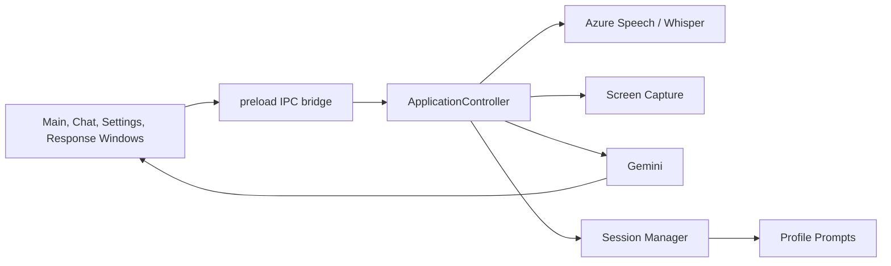
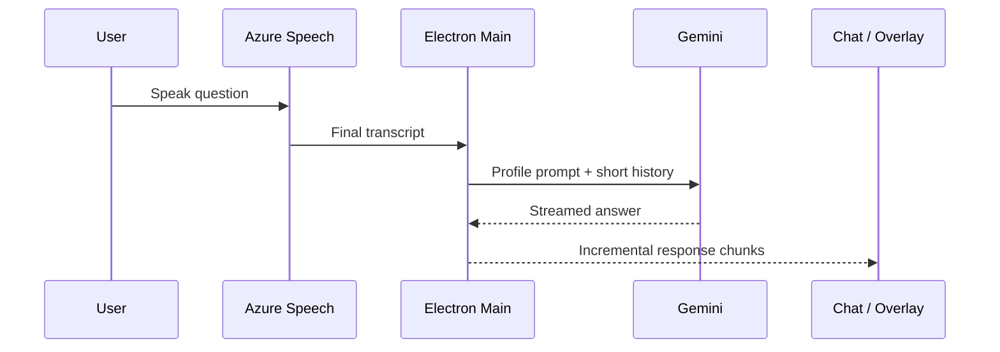

# OpenCluely V1 Implementation Plan

## Goal

Turn OpenCluely into a reliable local interview-practice and knowledge assistant before expanding it into a full universal skill platform.

V1 is successful when text chat, Azure microphone capture, screenshot capture, streaming responses, diagnostics, and the Amazon DCT profile work reliably through `npm start` on macOS.

## Current Architecture Map



## Current Data Flow



## V1 Scope

### 1. Reliability baseline — in progress

- [x] Add Amazon DCT prompt and question classification.
- [x] Add Gemini model selection and visible Gemini quota errors.
- [x] Add a diagnostics location and copy/open-log controls.
- [x] Add log redaction for API keys going forward.
- [x] Correct the macOS microphone audio path to send 16 kHz PCM to Azure Speech.
- [x] Add Azure audio-pipeline diagnostics.
- [x] Add actionable screen-capture permission errors.
- [ ] Validate live microphone transcription using `npm start`.
- [ ] Validate screen capture using `npm start`.
- [ ] Remove legacy logging that can expose credentials and rotate existing keys.

### 2. Performance observability

- [ ] Add one request ID spanning speech, Gemini, and UI rendering.
- [ ] Record STT, first-token, full-response, rendering, and end-to-end latency.
- [ ] Add a compact diagnostics view with recent errors and timings.
- [ ] Prevent duplicate retry paths after quota or network failures.

### 3. Universal skill foundation

- [ ] Replace hard-coded skill arrays with a skill registry.
- [ ] Define a manifest format: prompt, knowledge scope, response modes, language rules, and model preference.
- [ ] Migrate DSA and Amazon DCT to manifests.
- [ ] Add profile switching without restarting the application.
- [ ] Add response modes: Quick, Interview, Detailed, STAR, and Troubleshooting.

### 3A. First profile catalogue — in progress

- [x] Amazon DCT profile.
- [x] DevOps profile.
- [x] SDET profile.
- [x] Backend Engineer profile.
- [x] STAR response mode.
- [x] Leadership Principles mode.
- [ ] Add the remaining profiles only after reliability tests pass.

### 4. Prompt composition

- [ ] Compose prompts from Global Rules + Skill + Interview Profile + Company + User Preferences.
- [ ] Keep quick-answer prompts small enough for low latency.
- [ ] Add safe defaults for context limits and response token limits.
- [ ] Add prompt-version metadata to diagnostics.

### 5. Security and production readiness

- [ ] Remove the custom TLS certificate-verification bypass.
- [ ] Validate every IPC payload at the main-process boundary.
- [ ] Restrict privileged IPC to the minimum necessary surface.
- [ ] Separate session history, diagnostics, and settings storage.
- [ ] Add automated tests for prompt composition, configuration, and speech/capture error handling.

## Explicitly Deferred from V1

- RAG, PDF ingestion, embeddings, and a local vector database.
- A large catalogue of role profiles.
- Full UI redesign.
- Signed and notarized release builds.

These begin only after the V1 reliability baseline is verified.

## Current Test Workflow

Run locally:

```bash
npm start
```

Then verify:

1. Text chat: ask “What is DNS?”
2. Microphone: speak “What is DNS?”, then pause.
3. Screenshot: use `Cmd+Shift+S` while a visible question is on screen.
4. Diagnostics: Settings → Open Logs / Copy Diagnostics.

## Rules for This Development Phase

- Do not create a release build until the three primary workflows pass locally.
- Do not commit or push partial work until the V1 test checklist passes.
- Never put API keys, transcripts, or retrieved private documents into logs.
- Do not expand the skill catalogue while audio and screen capture remain unreliable.
# Phase 8 — UI/UX Redesign

Implemented locally (not yet committed): skill and language selection; interview company selection; Quick, Interview, Detailed, STAR, and Troubleshooting response formats; persisted dark/light appearance; and compact layout density. The active response format is supplied to Gemini as a system-level instruction for every interview profile.

# Phase 5 — Interview Mode Engine

Implemented locally: Amazon DCT, SDET, and DevOps profiles define their knowledge areas and response styles in a central profile registry. Each profile loads its own prompt, can be switched from Settings or the overlay navigation, and is validated before it becomes the active skill.

# Phase 4 — Programming and Platform Expansion

Implemented locally: the DSA language selector supports Python, Java, JavaScript, TypeScript, Go, Rust, C, C++, C#, Kotlin, Swift, PHP, Ruby, Bash, and PowerShell. Settings also provide optional technical-focus selectors for MySQL, PostgreSQL, MSSQL, Oracle, MongoDB, Redis, Elasticsearch, Cassandra, DynamoDB; AWS, Azure, GCP; Docker, Kubernetes, OpenShift; and Terraform, Ansible, Jenkins, and GitHub Actions. Selected focus is persisted and added to interview prompts when relevant.

# Phase 2 — Response Latency Optimization

Implemented locally: streamed Gemini output is incrementally rendered and throttled to avoid excessive IPC/UI updates; repeated short factual questions use a bounded ten-minute in-memory cache; Gemini HTTPS connections are reused; voice coalescing is reduced to 450 ms; and the Settings Performance view reports STT, first-token, full LLM, renderer, cache, and speech-to-answer timings. External Azure and Gemini service time still determines the practical lower bound.

# Phase 3 — Universal Skill System

Implemented locally: a declarative skill catalog now owns skill system prompts, knowledge scopes, response style, display format, latency preferences, language preferences, aliases, and categories. Static prompt files remain supported as overrides. Settings and overlay navigation load their available skills from the same catalog, covering interview, general, education, and general-AI skills.
