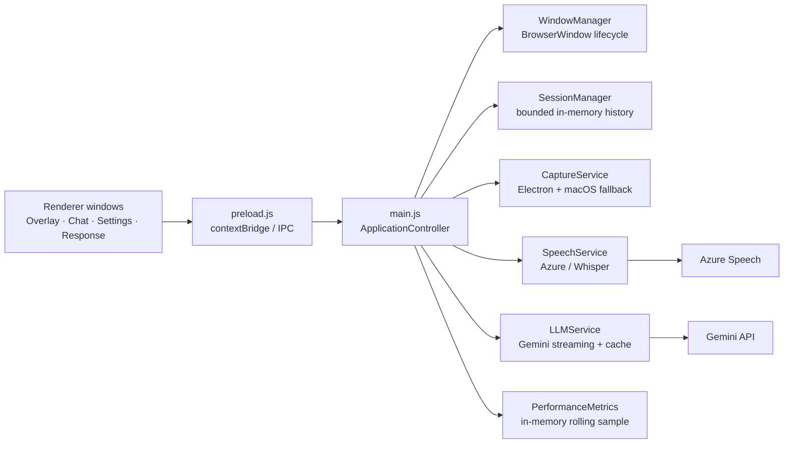
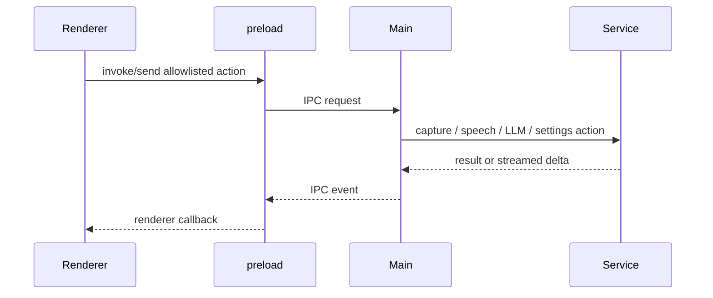

# OpenCluely V3 Beta Engineering Audit

Date: 2026-08-16  
Scope: static review of the Electron main process, preload bridge, renderers, services, managers, configuration, dependencies, and existing metrics. This report does not claim runtime measurements that were not collected from a controlled test run.

## Architecture

## Startup and shutdown flow

1. `main.js` resolves the user-data `.env`, loads configuration, then creates services and managers.
2. Electron readiness creates the configured windows and installs IPC handlers.
3. Settings load the active role, candidate context, job context, provider, and response preferences.
4. Speech and Gemini are initialized lazily or on setting changes.
5. On `will-quit`, global shortcuts are removed, speech shuts down, and windows are destroyed.

Strengths: state persistence is local; the Gemini client is reused; the response cache is bounded; renderer isolation is on.  
Gaps: startup duration is not timed; shutdown is not awaited or bounded; global crash guards can leave the process running after corruption.

## IPC flow

The preload bridge avoids direct Node exposure, but it exposes a large set of privileged actions. Most listener registrations do not return an unsubscribe function, so repeated renderer initialization can accumulate event listeners.

## Findings

| Priority | Finding | Root cause | Impact | Fix / effort |
|---|---|---|---|---|
| High | Global uncaught exception and rejection handlers keep the process alive | Catch-all handlers log but do not transition the app into a known-safe state | A corrupted service can continue running with stale resources | Add health state, stop affected service, show recovery action; 2–3 days |
| High | Broad IPC attack surface | Many privileged handlers; generic renderer receive API; limited per-sender validation | Compromised renderer has more capabilities than needed | Define channel schemas and sender/window checks; 3–5 days |
| High | Recurring overlay enforcement timers | Per-window 3-second interval plus blur/show/focus timer fan-out | Idle CPU wakeups and timer lifecycle complexity | Centralize one scheduler, clear on close; 2–3 days |
| Medium | Incomplete runtime observability | Metrics track durations only, in memory, with no process memory/CPU or startup spans | Cannot prove latency or 8-hour stability targets | Add process/resource snapshots and JSON diagnostics; 2–3 days |
| Medium | Session-manager initialization stores every prompt | All Markdown prompts become system events at startup | Avoidable memory and startup work as catalogue grows | Load only active prompt; fetch others lazily; 1–2 days |
| Medium | No test runner or CI quality gate | No `test` script or automated assertions | Regressions in IPC, speech, and window code reach users | Add Node unit tests then Electron integration smoke tests; 1–2 weeks |
| Medium | Unvalidated renderer IPC payloads | Resize/move/capture/settings handlers accept renderer values | Invalid values can cause errors or unexpected resource use | Strict type/size/range schemas; 2–3 days |
| Low | Duplicate legacy IPC paths | `invoke` and `send` variants exist for several speech/settings actions | Maintenance ambiguity and duplicate events | Deprecate one path after compatibility audit; 1–2 days |
| Low | Static role-name maps remain as fallbacks | Dynamic catalogue is loaded at runtime but legacy maps persist | Display drift for new skills if catalogue fetch fails | Replace fallbacks with a small generic formatter; 0.5 day |

## Low-risk hardening completed

- Config version now reads the root `package.json`, so diagnostics no longer report a stale `1.0.0` version.
- Packaged Electron windows now disable DevTools; local `electron .` development keeps DevTools available.

## Dependency review

The direct dependency tree contains Electron, electron-builder, Gemini SDK, Azure Speech SDK, Whisper capture/worker tooling, Winston logging, Markdown rendering, Prism, and Font Awesome. No direct unused dependency can be proven from static inspection alone; `markdown` and `marked` should be checked for duplicate usage before the next dependency refresh. Dependency vulnerability scanning requires a networked `npm audit` run and is not represented as a completed check here.
